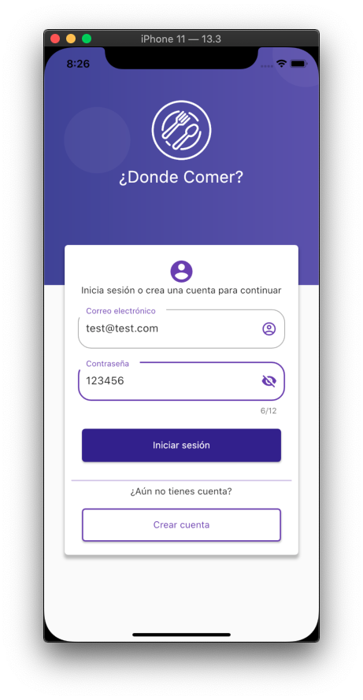
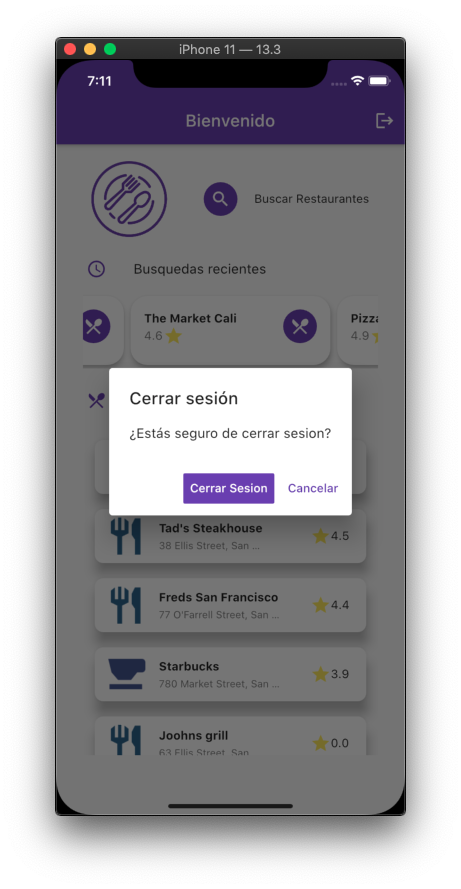
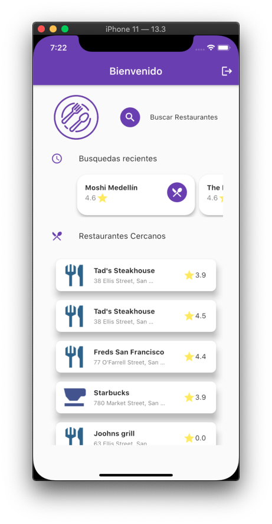
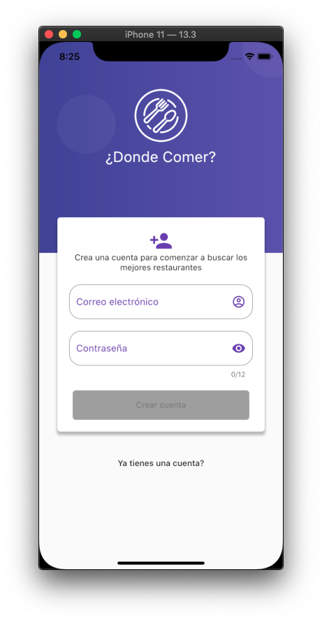
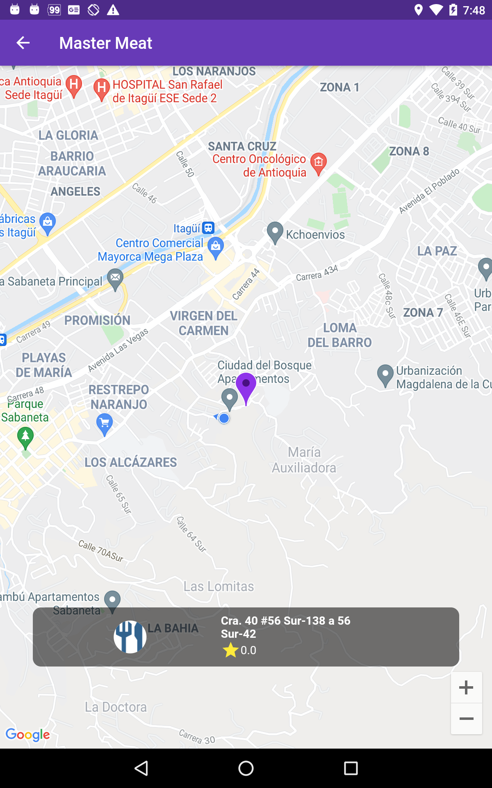
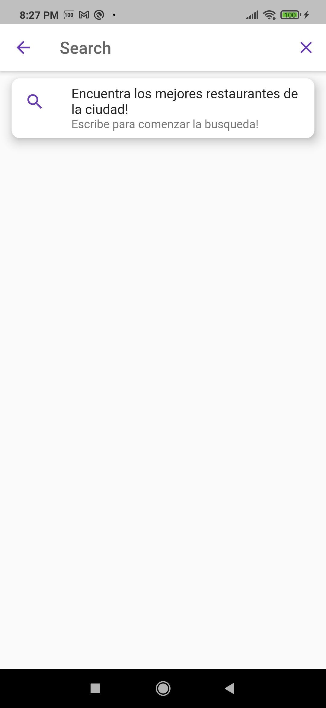
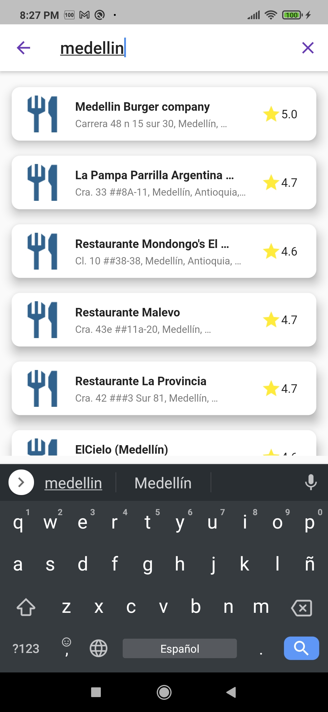
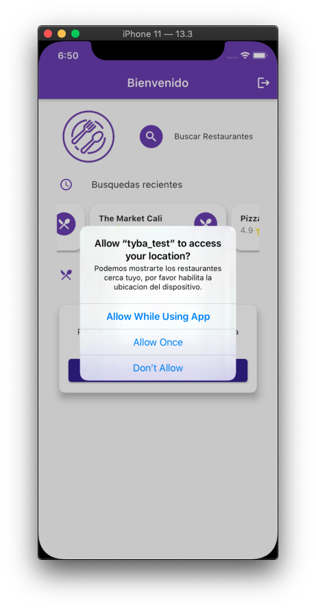
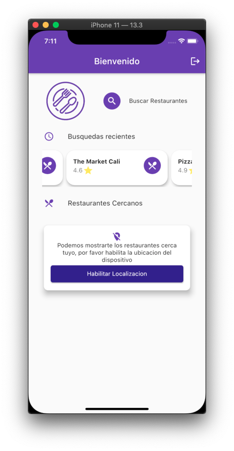

# tyba_test
Prueba técnica para aplicar de front-end en Tyba.

## Descripcion
  
**¿Donde Comer?** es una app desarrollado en Flutter que te permite buscar restaurantes cerca de ti o en cualquier ciudad; ademas de todo esto, cuenta con las siguientes funcionalidades

1. Registro de Usuarios

2. Inicio de Sesion

3. Cerrar sesion del usuario

4. Búsqueda de restaurantes por medio de una caja de busqueda

5. Búsqueda de restaurantes cercanos por medio de la ubicación del dispositivo.

6. Almacenamiento de las busquedas realizadas

7. Visualización de la ubicacion del restaurante

## Screenshots

    
    
    
    
    
    
    
    
    

## Getting Started

Estas instrucciones le proporcionarán una copia del proyecto en funcionamiento en su máquina local con fines de prueba.
 
- Primero, abre tu terminal y clona el repositorio en tu computador: <kbd> git clone git@github.com:Jhonsebas77/tyba-test.git </kbd>

- Ubicate en la carpeta donde clonaste el proyecto, e instala todas las dependencias:
   
>  $ cd tyba-test
>     $ flutter pub get

- Conecta un dispositivo Android a tu computador o abre un emulador de iOS o Android.

- Desde la terminal ejecuta:

> $ flutter run

- Inicia sesion o crea una cuenta para comenzar a buscar donde comer!

## Notes

* Se ha creado un usuario para facilidad de quien pruebe este proyecto. Las credenciales son las siguientes:

> usuario: test@test.com contraseña: 123456

* Para la busqueda de resultados estoy utilizando el Api de Google Places. Sin embargo, para almacenar las busquedas recientes se utiliza una base de datos en Firebase

  

* Al momento de almacenar los resultados, no alcance a segmentarlo por usuarios, por tal motivo es posible que aparezcan registros que no se hayan realizado, lamento los inconvenientes

  

* Para obtener la localizacion del usuario se utilizo el Plugin `Location`  [https://pub.dev/packages/location]; Desafortunadamente en un dispositivo con Android 10 esta teniendo inconvenientes al momento de obtener la localizacion; Sin embargo, se realizaron pruebas con emuladores de iOS y dispositivos fisicos con una version inferior de Android y funcionaron sin inconveniente

  
  
  
  
  

Autor

Sebastian Otalora - (https://github.com/jhonsebas77)
